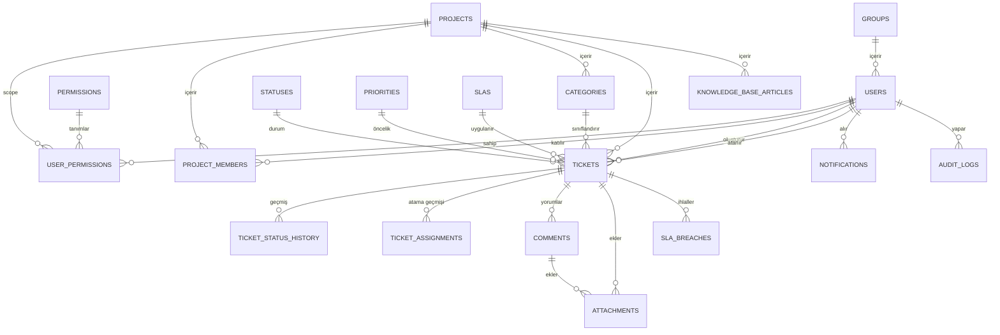

# ITSM Tool — Veritabanı Şema Planı

PostgreSQL için 20 tablo. Tüm PK'ler `BIGSERIAL`, zaman alanları `TIMESTAMPTZ`. Aşağıda her tablo, kolonları ve ilişkileri var; sonda tam DDL karşılığı `database/scripts/schema/001_initial_schema.sql` dosyasında.

## 1. Kullanıcı & Yetkilendirme

**groups** — iş birimleri (Yazılım Geliştirme, Sistem & Network, Destek Birimi, DB Yönetimi vb.)
- id, name, description, created_at

**users**
- id, group_id → groups.id, full_name, email (unique), password_hash, is_active, created_at, updated_at
- İlişki: bir grubun N kullanıcısı olur (1—N)

**permissions** — yetki katalog tablosu (TICKET_CREATE, TICKET_APPROVE, TICKET_ASSIGN, REPORT_VIEW, ADMIN_MANAGE, KB_MANAGE vb.)
- id, code (unique), name, description

**user_permissions** — kullanıcı bazlı esnek yetki ataması (grup değil, doğrudan kullanıcıya bağlı — aynı gruptaki iki kişi farklı yetkiye sahip olabilir)
- id, user_id → users.id, permission_id → permissions.id, project_id → projects.id (nullable, yetki proje bazlı da sınırlandırılabilir), granted_at
- unique(user_id, permission_id, project_id)
- İlişki: users N—N permissions (ara tablo project_id ile proje bazlı scope da destekler)

## 2. Proje Yapısı

**projects** — en az 5 farklı proje
- id, name, code (unique), description, is_active, created_at

**project_members** — kullanıcı hangi projelerde yer alıyor
- id, project_id → projects.id, user_id → users.id
- unique(project_id, user_id)
- İlişki: projects N—N users

**categories** — proje bazlı talep kategorileri
- id, project_id → projects.id, name, description
- İlişki: bir projenin N kategorisi olur (1—N)

## 3. Lookup Tablolar

**statuses** — Açık, Devam Ediyor, Beklemede, Çözüldü, Kapatıldı
- id, name, sort_order

**priorities** — Kritik, Yüksek, Orta, Düşük
- id, name, sort_order

## 4. Talep (Ticket) Çekirdeği

**tickets**
- id, project_id → projects.id, category_id → categories.id, ticket_type (CHECK: 'incident' | 'service_request'), title, description, status_id → statuses.id, priority_id → priorities.id, created_by → users.id, assigned_to → users.id (nullable), sla_id → slas.id (nullable), due_at, resolved_at, closed_at, created_at, updated_at
- İlişkiler: project (N—1), category (N—1), status (N—1), priority (N—1), created_by/assigned_to (N—1 users, iki ayrı FK)

**ticket_status_history** — durum geçmişi
- id, ticket_id → tickets.id, old_status_id → statuses.id (nullable), new_status_id → statuses.id, changed_by → users.id, changed_at

**ticket_assignments** — atama/transfer geçmişi
- id, ticket_id → tickets.id, assigned_from → users.id (nullable), assigned_to → users.id, assigned_by → users.id, assigned_at, note

## 5. SLA

**slas** — proje/kategori/öncelik bazlı süre kuralları
- id, project_id → projects.id (nullable = genel kural), category_id → categories.id (nullable), priority_id → priorities.id, response_time_minutes, resolution_time_minutes
- unique(project_id, category_id, priority_id)

**sla_breaches** — ihlal kayıtları (bonus: SLA ihlal uyarıları)
- id, ticket_id → tickets.id, breach_type (CHECK: 'response' | 'resolution'), breached_at, notified (boolean)

## 6. İletişim & Ek Dosya

**comments** — talep üzerine mesajlaşma
- id, ticket_id → tickets.id, user_id → users.id, message, is_internal (boolean), created_at

**attachments** — dosya/ekran görüntüsü
- id, ticket_id → tickets.id (nullable), comment_id → comments.id (nullable), file_name, file_path, uploaded_by → users.id, uploaded_at
- Not: bir attachment ya doğrudan ticket'a ya da bir comment'e bağlanır

## 7. Bildirim & Audit

**notifications**
- id, user_id → users.id, ticket_id → tickets.id (nullable), type, message, is_read (boolean), created_at

**audit_logs** — kim, ne zaman, ne yaptı
- id, user_id → users.id (nullable, sistem event'leri için), entity_name, entity_id, action, details (jsonb), created_at

## 8. Bilgi Bankası & Otomatik Atama (bonus)

**knowledge_base_articles**
- id, project_id → projects.id (nullable, genel de olabilir), category_id → categories.id (nullable), title, content, created_by → users.id, is_published, created_at, updated_at

**auto_assignment_rules**
- id, project_id → projects.id, category_id → categories.id (nullable), assign_to_user_id → users.id (nullable), assign_to_group_id → groups.id (nullable), priority_order

## İlişki Diyagramı (özet)

## Notlar

- `permissions` bir katalog, `user_permissions` atama tablosu — yeni yetki eklemek şema değişikliği gerektirmez.
- `project_id` nullable olan FK'ler ("genel kural" / "genel makale") esnekliği sağlıyor; proje bazlı override, proje-null olan genel kuralın üzerine yazar.
- `ticket_status_history` ve `ticket_assignments` ayrı tutuluyor çünkü ikisi farklı olayları temsil ediyor (durum değişimi vs. sorumlu değişimi); ikisi birlikte `audit_logs`'un ticket'a özel, sorgulanması kolay alt kümesi gibi düşünülebilir.
- `ticket_type` şimdilik CHECK constraint'li bir string; ileride tür başına farklı alan gerekirse ayrı bir `ticket_types` tablosuna taşınabilir.
